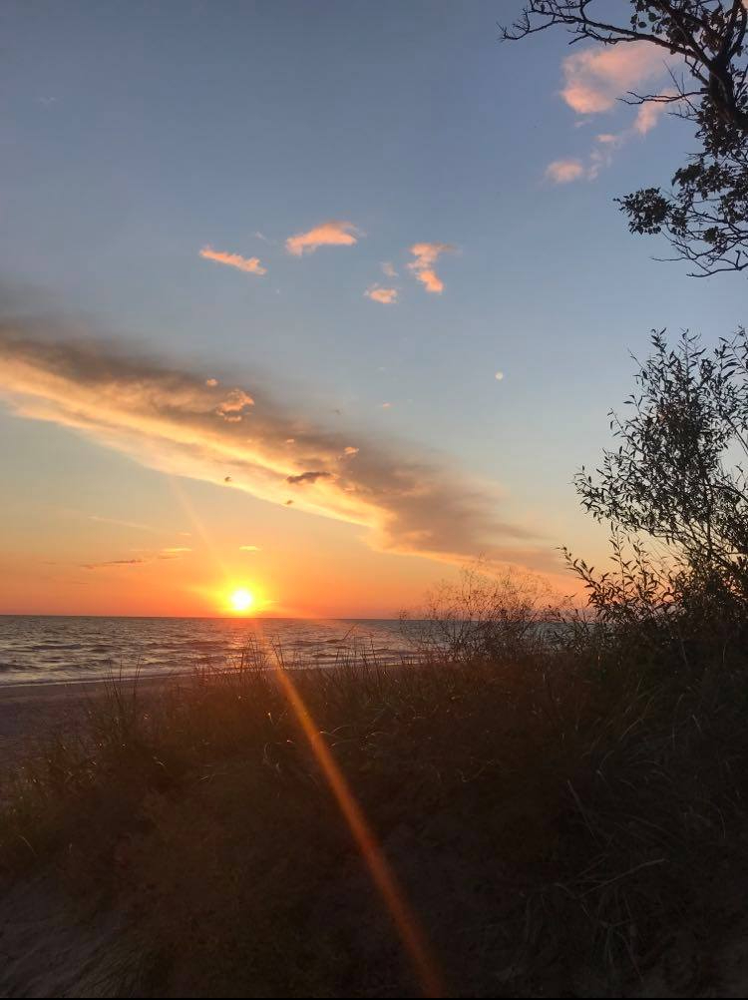

ARCHIVE  
EN  
2021-08-08, 2021-08-15

# Ideas for the future

So a lot of you was asking in the comments, what I have engaged with recently…

Just kidding. My website is being viewed by literally one person. And it is me.

Now about my plans for the future. First of all I should decide WHAT I WANT (I guess it is the same as WHAT I SHOULD WANT). How to achieve it? I need more sociability. Business-like (actually did not find the suitable word for this) sociability. I need to forge some connections between people, who could tell me, what would they do in my scenario.

I do not expect to happen it just like _snap_ that. I KNOW it is not going to happen like that. Therefore I crave (don’t really know, if this word suits here) publicity, which I was isolated from, crave sharing my activities, hobbies, achievements (first of all – gaining them), which I have loads of and… there are very few, who know them… Basically no one.

So. What am I going to do?

Pi
I think you all know that does this greek letter π mean in math. It is basically a constant, which has infinitely many randomly positioned digits after decimal point. And what you can do with whose digits? It’s simple – memorize them. And that’s what I’m going to do. Memorize 13963 digits (you can guess why I’ve chosen such strange number :D) of pi and in March 14th I’m going to write it on paper during pi championship in Vilnius. Well, I actually want to find out if the prize for this (for official record in Lithuania – for now it is 10 003) really is 3,141.59 €. If it is, in my opinion it is quite worth all the effort. Despite the fact, that for me it is easier than for other average person, who thinks it is mind-blowing to memorize that much of randomized digits.

For the record (that you wouldn’t think that I am just messing with you), I’ve already memorized about 1170 digits. Here are 1164 digits (that is how much of the second thousand I’ve managed to recite).

π ≈ 3.14159265358979323846264338327950288419716939937510 58209749445923078164062862089986280348253421170679 82148086513282306647093844609550582231725359408128 48111745028410270193852110555964462294895493038196 44288109756659334461284756482337867831652712019091 45648566923460348610454326648213393607260249141273 72458700660631558817488152092096282925409171536436 78925903600113305305488204665213841469519415116094 33057270365759591953092186117381932611793105118548 07446237996274956735188575272489122793818301194912 98336733624406566430860213949463952247371907021798 60943702770539217176293176752384674818467669405132 00056812714526356082778577134275778960917363717872 14684409012249534301465495853710507922796892589235 42019956112129021960864034418159813629774771309960 51870721134999999837297804995105973173281609631859 50244594553469083026425223082533446850352619311881 71010003137838752886587533208381420617177669147303 59825349042875546873115956286388235378759375195778 18577805321712268066130019278766111959092164201989 38095257201065485863278865936153381827968230301952 03530185296899577362259941389124972177528347913151
55748572424542 (I know, the last digit should be 1, but since 5 follows it, it has to be increased for approximation)

Actually, it is not so hard to learn those, if you group them in various groups (depending on what numbers is easier for you to remember) and find as much as possible relations and connections between those numbers.

Tbh, it’s not really the matter of money (well, it is still kinda great to receive a few k euros) – I’m more concerned about the participation in the pi championship; paper, which shows that I was engaged in something, not just laying on a couch and watching tiktok; most importantly the record of my 9th grade free-time activity which wasn’t appreciated at the time (I’ve learned 1000 digits at that time).

Anyways. In the future I will be writing something more about my pi learning achievements. And maybe I could reveal some tactics I’ve used or will be using.

Don’t really know in what format I will write in the future, haven’t decided yet. For now I’m just writing some text to clear my mind.

Writing
Yeah. Blog is not the only place where I clear my mind via writing. I am also writing some fiction. I’ve mentioned it before.

Since I decided to apply for studies the UK and US prestigious universities next year (I guess that would count as a gap year, only that I will be studying at Vilnius university), I have to plan my time better and get rid of some drag out activities – e.g. writing the book called Snow. I’ve planned the whole (almost) plot of it a while ago, so there’s no reason to procrastinate. I should live more active (in hobbies/activies manner) life and get engaged with more things. I will try not to rush too much but I will write in more vivid manner (if everything go as smooth as I expect).

Firstly, I am going to edit whole piece of text (of 30,000 words), which is the first part of story. Wish this won’t take long and will increase the quality of text. And then, as soon as I finish editing the first part, I am going to head straight to the second part which about one third I’ve already written of. But for now let’s just end the first part so that my friend could finally read it.

Teaching
So there exist one thing that worth mentioning – I love explaining and teaching something, that I’ve learned and really understand. I’ve helped some of my friends with math – I didn’t even requested any money (well, except when I had to spend some particularly for the tutoring), I was happy to help.

But I’ve also realized something – it takes not so little time to explain everything needed for math state exam (in Lithuanian “VBE”). And also I have other things to do – don’t want to waste too much time on this (especially unpaid). Therefore in near future I will post somewhere that I am tutor and I can teach math (also physics and IT) and earn some money. And also I will try to do this legally, paying all the taxes, so I could have a paper that says “Audrius actually was teaching”.

That’s it for the future plans. This is the beginning.

These posts… It might look boring for now. Because I am writing only text. Without many images. I will add them in the future posts. More and more. And the text is not very structured and formal. But for now let’s keep it that way.

P. S. I was recently considering writing future posts in two languages (Lithuanian also). Doubtful, but maybe this idea will suceed.

Audrius

2021-08-08, 2021-08-15
