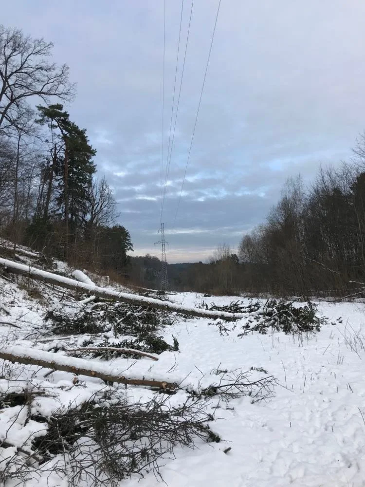
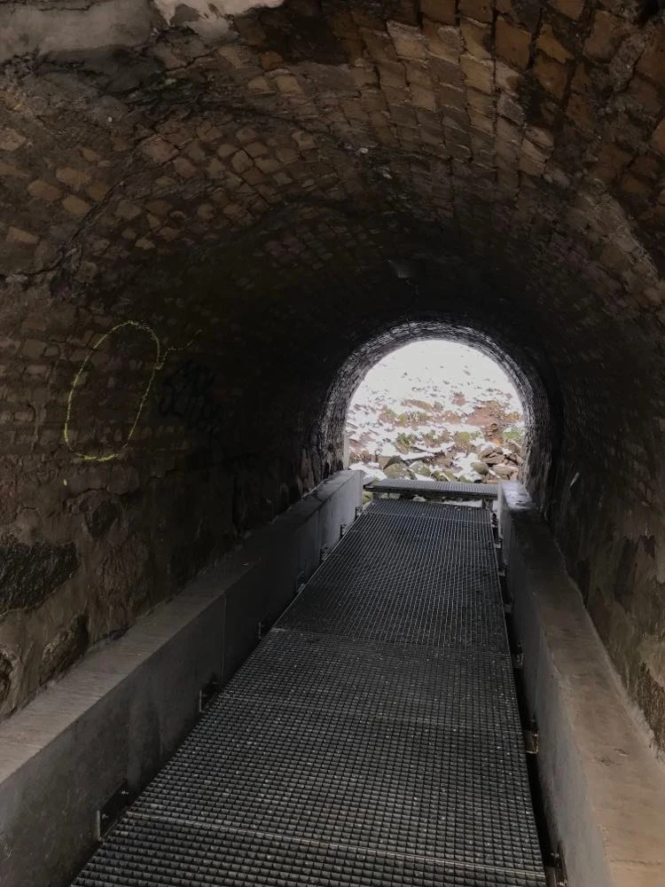
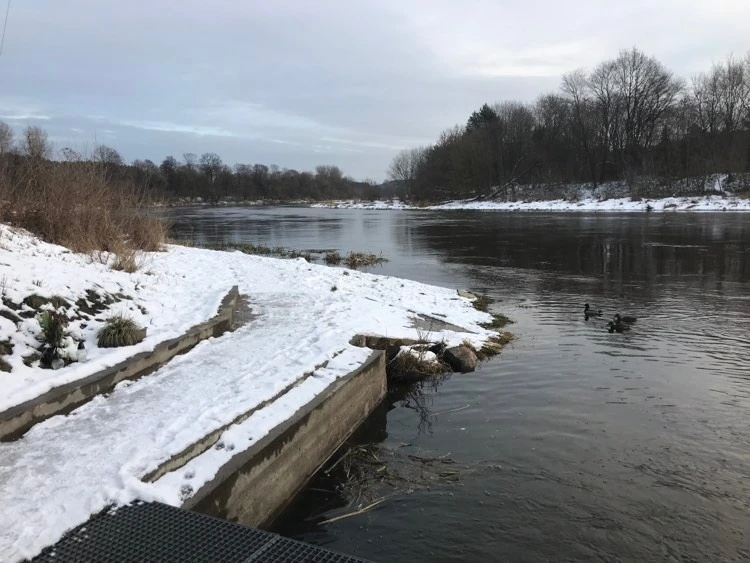
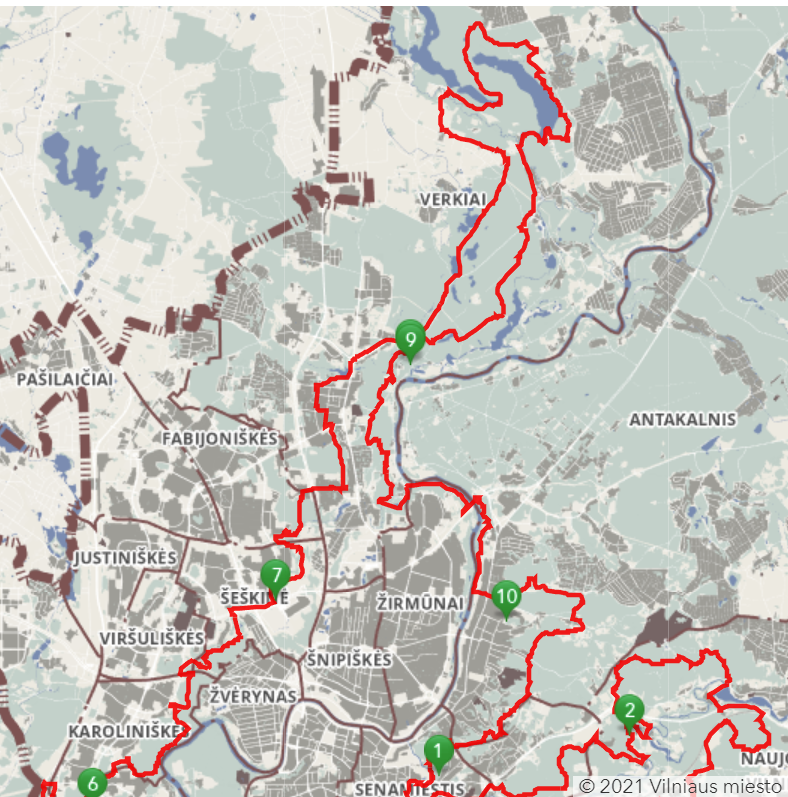

ARCHIVE  
LT  
2021-12-05

# 50 km pėsčiom

Šviesos. Kalėdinės šviesos ant priekyje einančio žmogaus batų. Užsidega ir užgesta. Kalėdinės, šalia keliu pravažiuojančių mašinų šviesos. Jau net galvos nebesu pakėlęs, nes tai reikalauja papildomų jėgų, o jas reikia pasitaupyti, jei noriu kažkur dar nueiti. Bet tai jau nebelabai man rūpi. Eičiau vienas – seniai jau būčiau pasigavęs kokį autobusą ir nuvažiavęs namo. Bet jau nebe tiek ir toli. Na, 10 km gal dar liko, bet manau įveiksiu.

– Na, ką, jau tuoj ir finišas.

Ne. Tai nebuvo finišas. Mes ėjom toliau. Ir toliau. Jau atrodė tikrai viskas, mes jau miestu einam. Ne. Dar toliau. Niekada nesibaigia. Tie 10 km buvo patys sunkiausi. Kaip visada.

Na, gerai, gal ir pamelavau. Ne visiškai 50 km. Pagal Vilniaus 100 km tako žemėlapį, tai kažkur 45.9 km. Bet 50 daug gražiau atrodo. Ir techniškai, iš viso gal ir susidėjo 50, plius dar nebuvo kelias visas lygus, buvo ir kalnelių, tai dar ir prie to gal verta būtų pridėti kokį koeficientą.

Gerai. Pradėkim iš naujo. Vakar (šeštadienį) pagaliau įvyko žygis, kurio ilgai laukiau – žygis, po kurio jausčiausi išsekęs. Na, gal šįkart labiau tik kojos jautėsi išvargintos. Taip gerai padirbėjusios. Žodžiu ėjau su keliai random žmonėmis, surinktais tuo pačiu tikslu – ėjimui – iš VUŽK fb grupės. Kažkas organizavo, tik gavosi kad tas kažkas taip ir nesudalyvavo. Eiti buvo planuota vieną dieną, o atstumą sakė kad tipo nebūtinai 100 km. Tipo no shit, žmonės, ką, jūs galvojat pririnkti žmonių, kurie norėtų random pasivaikščiodami per dieną nueit 100 km? Na, gal šįkart ačiū. Of course, yra žmonių, kuriem tai nėra kažkas tokio. Man iš pradžių irgi taip atrodė, kai nuėjęs 30 km pajūriu nieko nepajaučiau. Bet damn, čia po kalnelius ir sniegą buvo ką veikt.

Nu, žodžiu, buvo mūsų iš viso 5 lygtai. Bet ties 20km jau buvo visi išsiskirstę, likom tik dviese su kažkokiu žmogumi, kurio nebuvau matęs nė karto savo gyvenime. Bet tai nebuvo esmė. Esmė, kad buvo su kuo eiti, kad ne vienam. Tai va su tuo žmogumi ir nuėjom nuo to išsiskirstymo taško dar 30 km.

Pradėjom žygį nuo 1 punkto ant Stalo kalno(pridėjau žemėlapį), tik ėjom į priešingą pusę, t.y. link antakalnio 10 punkto ir tada 9 ir taip toliau. Baigėm ties 7 punktu kažkur. Prie Akropolio netoli išsiskyrėm ir aš jau nuvažiavau autobusu.

Pora dar dalykų apie ėjimą in general ir tada jau einu ruoštis programavimo atsiskaitymui.

Pirmiausia, tai turėjau tokius gal du ryškesnius ėjimus. Vienas tai pajūriu Latvijoje (40 km), o kitas namo iš Utenos (35km). Pirmas išvargino, bet kažkaip išgyvenau. Antram prireikė ir lazdos, bei batai mano buvo ne kokie, nelabai buvau pasiruošęs tiek eit, tai po to padai truputį kentėjo. Tai čia trumpai taip, pagalvojau nesiplėsiu.

Kitas dalykas, tai galvoju organizuoti daugiau ėjimo. Pvz, kitą savaitgalį bandysiu suorganizuoti ėjimą su draugais, kad tuo pačiu ir traukiniu pavažinėt. Būtų kaip ir su nakvyne, bet bandysiu visiem įtikt. Tai čia dar žiūrėsiu kaip gausis. O po to reikės kažką organizuoti kad kone kiekvieną savaitgalį kažkokį ėjimą. Gal ir su žygeivių klubu kažką sutart bus galima.

Tai tiek. Sutrumpinau pabaigą, nes turiu daug ką nuveikt dar.

Žemėlapis:

https://vilnius100km.lt/

Pora nuotraukų:

Audrius

2021-12-05
