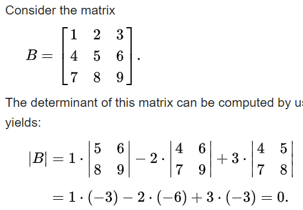

ARCHIVE  
EN & LT  
2021-08-31

# Linear algebra (unfinished)

IN MY OWN STYLE

Let’s go straight forward to the point.

## Gauss-Jordan elimination

Gaussian elimination – to row echelon form

Gauss-Jordan elimination – to reduced row echelon form

1. linear system of equations
2. finding inverse matrix

Operations:

- rR
- R1 + R2
- R1 -> R2

> Gaussian elimination – tik pirmas etapas. Antras ir trečias etapas padaromi kartu, perkonvertavus į lygčių sistemą ir įsistatinėjant iš apačios į viršų

> Pimojo etapo galimi tarpiniai veiksmai.

## SOME DEFINITIONS:

Linear equation: $a_1x_1 + a_2x_2 + … + a_nx_n = b; (l_1, l_2, …, l_n)$

### Types of equations:

No solution/there’s solution – inconsistent/consistent (neuderinta/suderinta)
1 solution/more than 1 solution – apibrėžta/neapibrėžta (ANGL?)

### Matrices:

Triangular
Trapezoidal – in gaussian elimination t substitution for laisvieji kintamieji in the last row (ANGL?)
Row echelon form, Reduced row echelon form

Transpose

matrix of minors

matrix of coprimes

Inverse, Identity

invertible/singular matrix – has (/not) inverse (square; det(A) != 0)

## Finding inverse

1. Gauss-Jordan

2. Adjancency matrix, matrix of coprimes, determinant

[youtube link](https://www.youtube.com/watch?v=S4n-tQZnU6o)

## Determinant

1. Rule of Sarrus

2. Laplace expansion

3. Unidentified

## Let’s talk about matrices…

Matrix addition/subtraction

Matrix multiplication

Finding inverse matrix

Identity matrix
Adjancency matrix
Matrix of coprimes
Determinant
Gauss-Jordan elimination
Vectors…

Cross product

Dot product

.

.

.

## List:

Rank-nullity theorem

kernel, dimension, linear map, rank, null, nullspace, projection

matrix of minors, matrix of cofactors

Transpose

linear transformation

## Links

[Gauss-Jordan elimination youtube](https://www.youtube.com/watch?v=eYSASx8_nyg)
[gaussian elimination youtube](https://www.youtube.com/watch?v=TiojznkrRIQ)
[row echelon form, reduced echelon form](https://www.youtube.com/watch?v=XDafiM4Cyb4&t=59s)
[gauss-jordan finding inverse](https://www.youtube.com/watch?v=obts_JDS6_Q)
