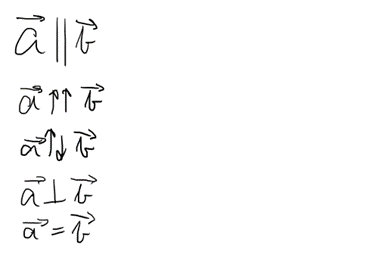
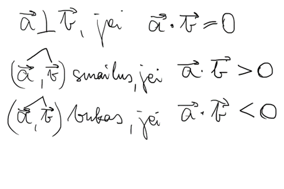

subject: MATH  
grade: 11
type: EVERYTHING
lastUpdated: 2023-08-18

# Vectors

**Vektorius** – dydis, kuris turi kryptį (ne tik skaliarinę vertę) – paprasčiausia rodyklė. Pvz.: greitis, jėga.

**Skaliaras** – dydis, kuris neturi krypties (tik skaliarinę vertę). Iš esmės visi įprasti dydžiai – pvz.: atstumas, masė.

## Rūšys

Kolinearūs - lygiagretūs

## Aritmetika

Sudėtis ir atimtis

Daugyba iš skaliaro

Skaliarinė vektorių daugyba

## Koordinatės, ilgis

## Kolinearumo savybė

## Statmenumo, bukumo, smailumo savybė

## Vektoriai erdvėje

## Uždaviniai

1.

2.

3.

4.

Uždavinių tipai not done

Not done (vektorių išreiškimas kitais vektoriais, a^2, reiškiniai)
